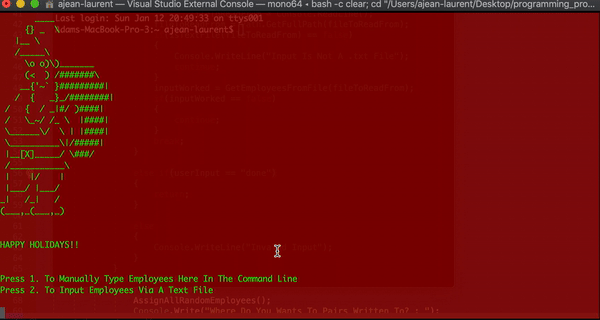

# Secret Santa

This purpose of this console application is to help offices or groups of friends easily assign eachother secret santas!

## How To Use

- Clone This Repository
- You may have to install visual studio in order to run the .exe file in secret-santa/bin/debug or run the application in and IDE such as visual studio.

## Gif Of Usage

## Instructions

- First, the user must provide a list of an even number employees for the program to randmoly pair with eachother. This can be done in two ways, the first is to type them name by name on the command line, the second is to provide them in a .txt file, with each name on it's own line.

- Then, the program creates a text file with the randomly generated pairs!
